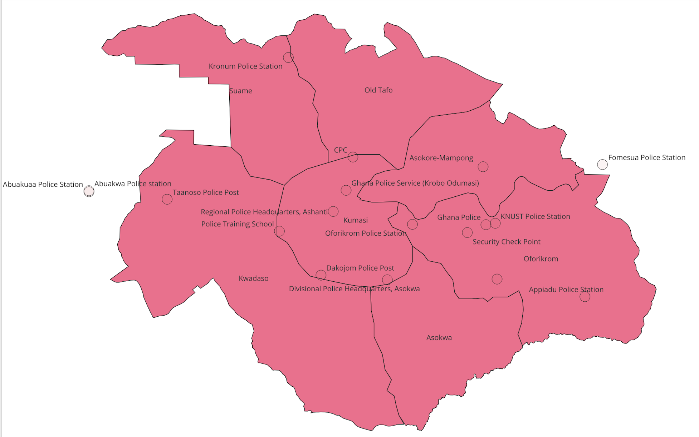
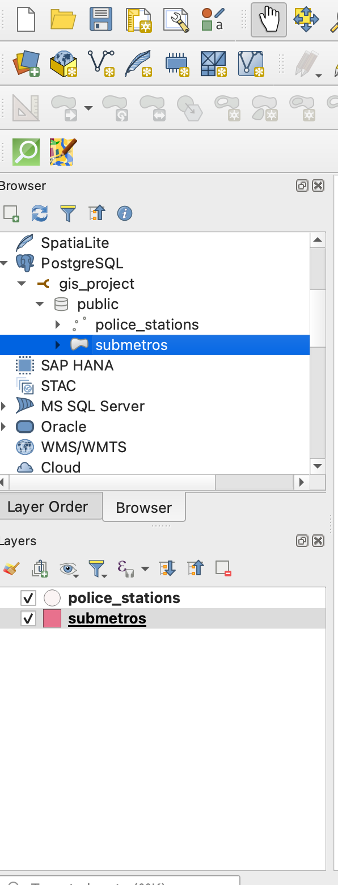
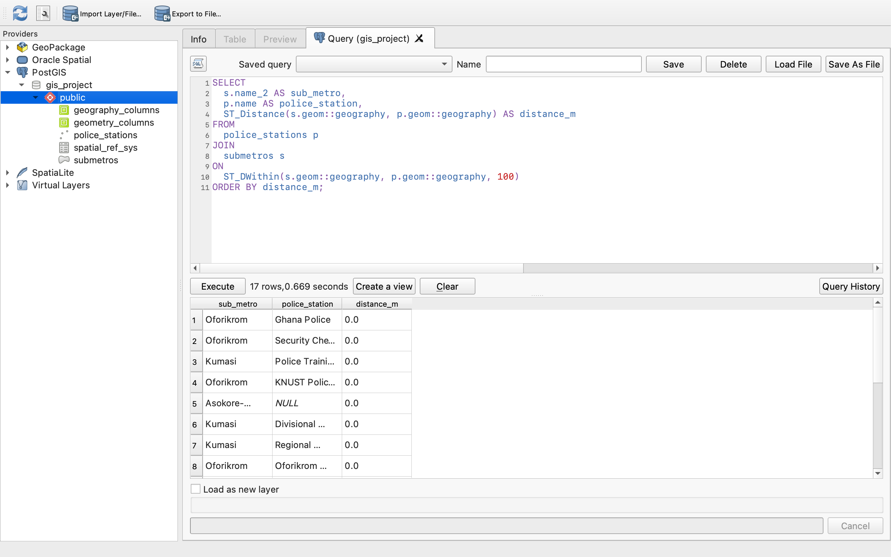

# 📍 Kumasi Sub-Metros and Police Stations Spatial Analysis (PostGIS + QGIS)

## 📌 Project Overview
This spatial analysis project visualizes the distribution of police stations within Kumasi’s sub-metros using a combination of PostGIS for spatial querying and QGIS for visualization.

It demonstrates how to:
- Import spatial datasets into a PostgreSQL/PostGIS database
- Perform spatial joins and proximity queries with SQL
- Connect and visualize PostGIS layers in QGIS
- Document the process through clean screenshots and SQL scripts

---

## 📊 Key Tasks
- Imported `police_stations.shp` and `submetros.shp` into PostGIS using `shp2pgsql`
- Executed spatial queries using `ST_Intersects` and `ST_DWithin`
- Visualized live PostGIS layers in QGIS
- Captured results for GitHub portfolio documentation

---

## 📷 Screenshots

       🗺️ Map View in QGIS  
Visualizing the Kumasi sub-metros (polygons) and police stations (points) in QGIS.

---

       🔗 QGIS PostGIS Database Connection  
Live database connection to PostGIS within the QGIS Browser Panel.

---

       📑 Proximity Query Results  
Proximity query result showing police stations within 100 meters of sub-metros.

---

       📑 SQL Queries  
All SQL scripts used in this project are available in the `SQL/` directory:
- `police_stations_in_submetros_intersects.sql`
- `police_stations_near_submetros_proximity.sql`

---

## 🛠️ Tools Used
- PostgreSQL + PostGIS
- QGIS
- MacOS
- shp2pgsql
- psql

---

## ✨ Author
**Barbara Nyame (Babs)**

---

## 📌 License
Open source. Feel free to fork and adapt.
